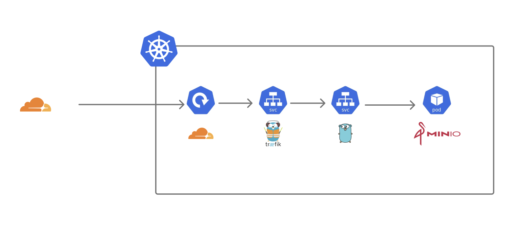

import { Code } from 'astro:components';

## 移行
blogのCloudflarePagesから自宅サーバーへの移行を行いました。kubernetes上で動いている静的ファイル配信サーバーからhtmlをレスポンスしています。

## アーキテクチャ

自宅サーバー内でのアーキテクチャは以下のようになっている。

静的ファイルを配信するstatic-serverをGolangで実装して、hostの名前で取得対象とするバケット名を決めることで表示したいHTMLを制御しています。

https://github.com/seipan/infra/tree/main/apps/static-server

これをKubernetes上にServiceとして立ててCloudflare Argo tunnel経由で配信しています。

## blog

blog側ではGHA上で、自宅サーバーのminioに対してビルドした結果をpushしている。

https://github.com/seipan/blog

## 雑メモ

### Zero trustで保護しているMinioへのpush

ZeroTrustで保護しているminioサーバーへのGHAからのプッシュに苦労した。自宅サーバーのほとんどのホストをZero Trustで保護しているので、通常通りではプッシュできなかった。

なので、AccessでService Tokenを使ってアクセスできるようにして、その「Client ID」「Client Secret」をヘッダーに付与してプッシュするようにする。

ただminoのmc clientのCLIではカスタムのヘッダを付与できなかった。proxy serverを使ってみたりしたけどhostが書き換わったりHTTPSだとうまくいかなかったので、minioにプッシュするコードをjsで書いてGHA
で実行している。